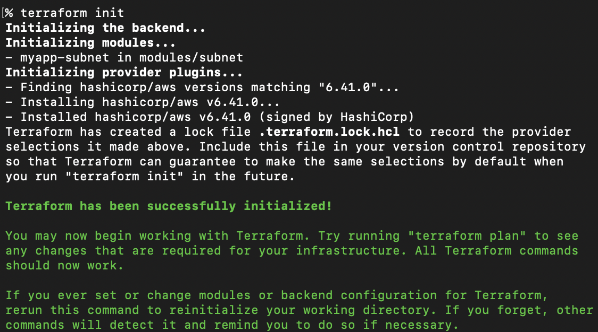
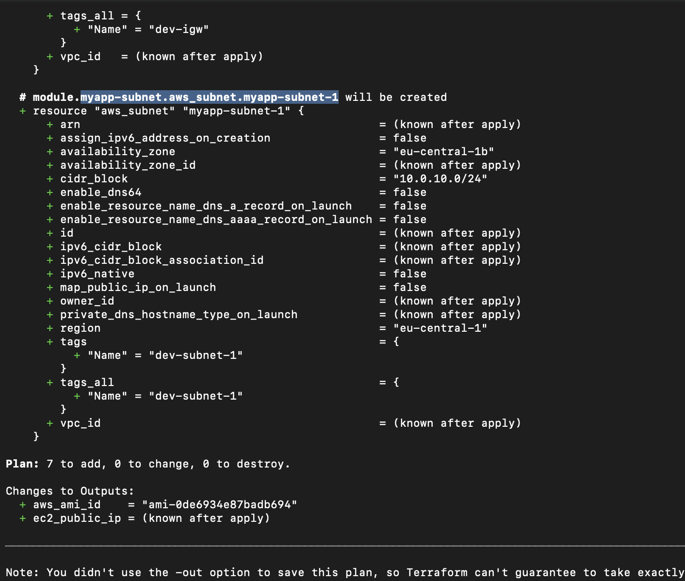
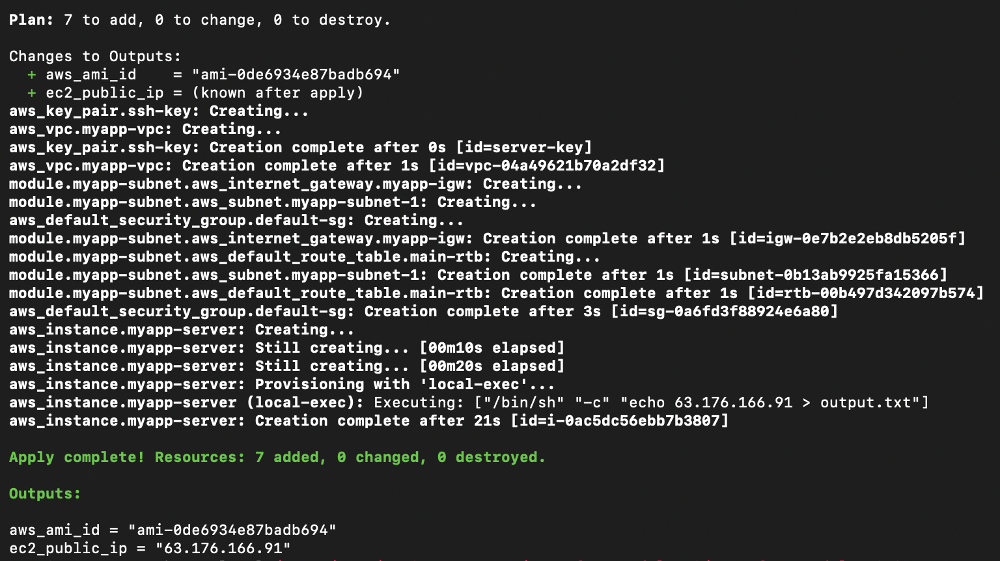
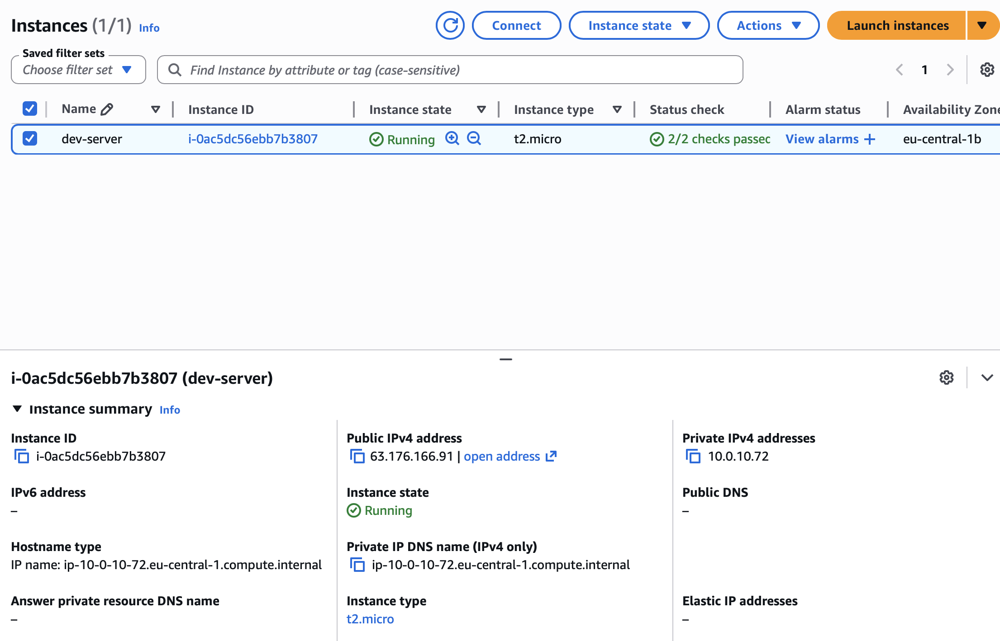
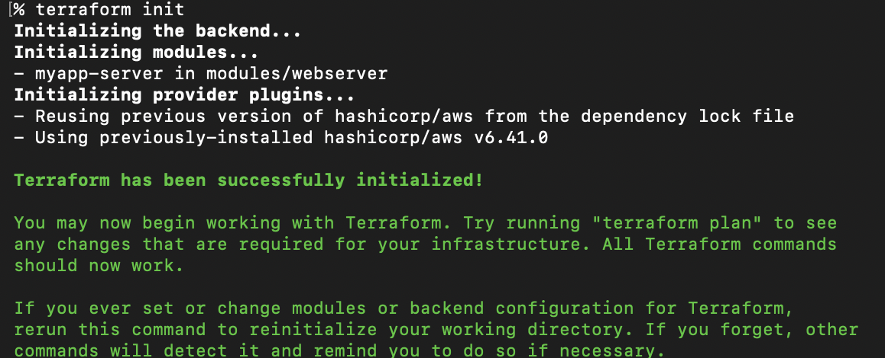
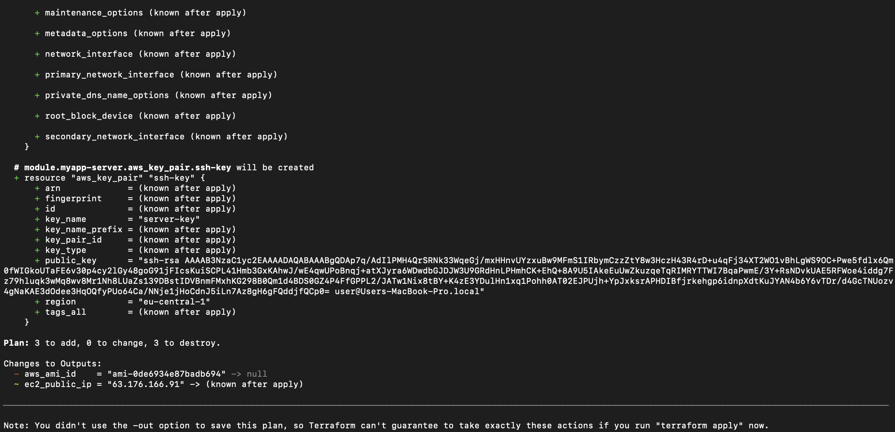
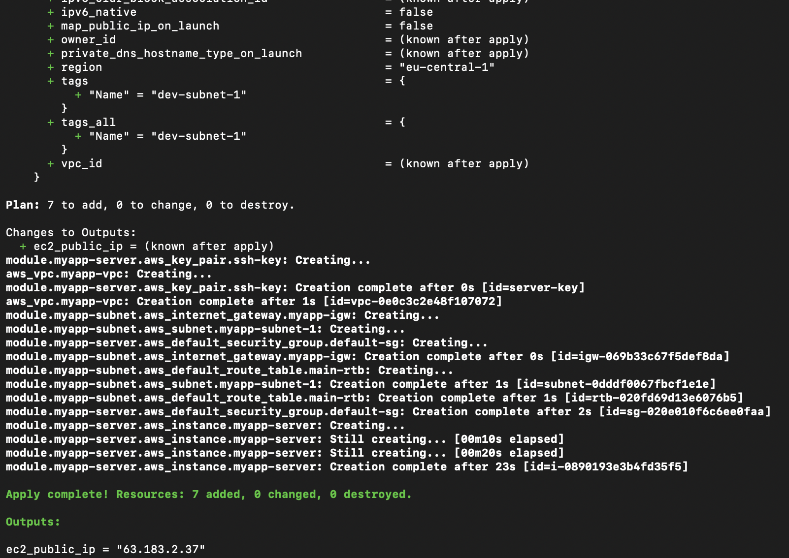
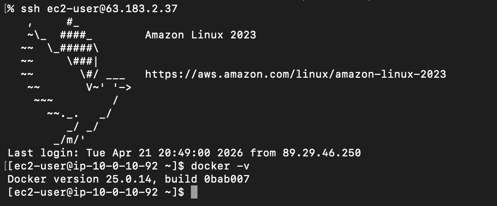

# Module 12 - Infrastructure as Code with Terraform

This repository contains a demo project created as part of my **DevOps studies** in the [TechWorld with Nana – DevOps Bootcamp](https://www.techworld-with-nana.com/devops-bootcamp).

**Demo Project:** Modularize Project

**Technologies used:** Terraform, AWS, Docker, Linux, Git

**Project Description:**

- Divide Terraform resources into reusable modules

---

### Prerequisites

Complete this demo project before start:

Automate AWS Infrastructure

https://github.com/explicit-logic/terraform-module-12.1

Create `terraform.tfvars` and set your values

```sh
cp terraform.tfvars.example terraform.tfvars
```

---

### Modules

> Container for multiple resources, used together

Why Modules?

- Organize and group configurations
- Encapsulate into distinct logical components
- Re-use
- Group multiple resources into a logical unit

Input variables -> Webserver module -> Output values

input variables = like function arguments

output variables = like function return values

### Project structure

- main.tf
- variables.tf
- outputs.tf
- providers.tf


### Prepare modules directory

- Create `modules` directory and subfolders for modules: `subnet`, `webserver`

- Create tf files inside of the each module dir: `main.tf`, `outputs.tf`, `variables.tf`, `providers.tf`

### Create `subnet` module

- Move `"aws_subnet" "myapp-subnet-1"`, `"aws_internet_gateway" "myapp-igw"`, `"aws_default_route_table" "main-rtb"` to `modules/subnet/main.tf`

- Replace references that are not exist inside the module with variables

- Define variables in the module `variables.tf` file

- Add the module to `main.tf` and pass variables

```tf
module "myapp-subnet" {
  source = "./modules/subnet"
  subnet_cidr_block = var.subnet_cidr_block
  avail_zone = var.avail_zone
  env_prefix = var.env_prefix
  vpc_id = aws_vpc.myapp-vpc.id
  default_route_table_id = aws_vpc.myapp-vpc.default_route_table_id
}
```

- Configure the module output

```tf
output "subnet" {
  value = aws_subnet.myapp-subnet-1
}
```

Replace `subnet_id` with `subnet_id = module.myapp-subnet.subnet.id` in `"aws_instance" "myapp-server"` (`main.tf`)

- Apply terraform configuration

```sh
terraform init
```



```sh
terraform plan
```



Execute
```sh
terraform apply --auto-approve
```



EC2 instances was created and running



### Create `webserver` module

- Move `"aws_default_security_group" "default-sg"`, `"aws_ami" "latest-amazon-linux-image"`, `"aws_key_pair" "ssh-key"`, `"aws_instance" "myapp-server"` to `modules/webserver/main.tf`

- Replace references that are not exist inside the module with variables

- Define variables in the module `variables.tf` file

- Add the module to `main.tf` and pass variables

- Add the module to `main.tf` and pass variables

```tf
module "myapp-server" {
  source = "./modules/webserver"
  vpc_id = aws_vpc.myapp-vpc.id
  my_ip = var.my_ip
  env_prefix = var.env_prefix
  image_name = var.image_name
  public_key_location = var.public_key_location
  instance_type = var.instance_type
  subnet_id = module.myapp-subnet.subnet.id
  avail_zone = var.avail_zone
}
```

- Configure the module output

file: `modules/webserver/outputs.tf`
```tf
output "instance" {
  value = aws_instance.myapp-server
}
```

file: `outputs.tf`
```tf
output "ec2_public_ip" {
  value = module.myapp-server.instance.public_ip
}
```

- Apply terraform configuration

Execute

```sh
terraform init
```



```sh
terraform plan
```



```sh
terraform apply --auto-approve
```




SSH to the instance
```sh
ssh ec2-user@<ec2_public_ip>
# to check script was run
docker -v
```


